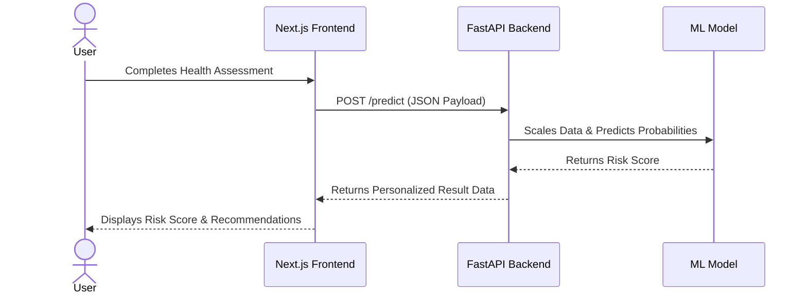
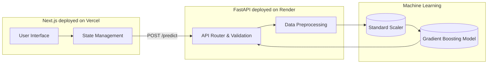

# 🩺 HealthSense AI

**An AI-powered health risk prediction web application.**

---

## 📖 Project Overview
HealthSense AI is an interactive, AI-driven health risk assessment tool. Users complete a guided health and lifestyle questionnaire through a modern Next.js frontend. The collected data is sent to a FastAPI backend, where a trained Machine Learning model evaluates the inputs against the CDC BRFSS 2015 dataset. The application then provides a personalized health risk score, risk level, identified risk and protective factors, and actionable wellness recommendations.

---

## ✨ Key Features
- **Interactive Assessment Wizard:** A responsive, multi-step form collecting personal, lifestyle, and symptom information.
- **Real-Time ML Predictions:** Instant cardiovascular health risk estimation using a pre-trained Machine Learning model.
- **Explainable AI Outputs:** Clearly identified "Risk Factors," "Protective Factors," and factors considered by the model to build user trust.
- **Personalized Recommendations:** Actionable, medically-safe wellness suggestions based on the user's specific inputs and risk tier.
- **Robust API Validation:** Strict data validation using Pydantic on the FastAPI backend.

---

## 🔄 Application Workflow



---

## 🏗 System Architecture



---

## 💻 Tech Stack

**Frontend**
- Next.js (React Framework)
- TypeScript
- Tailwind CSS

**Backend**
- FastAPI
- Pydantic
- Uvicorn
- Python 3

**Machine Learning**
- Scikit-Learn
- Numpy
- Joblib

**Deployment**
- Frontend: Vercel
- Backend: Render

---

## 🧠 Machine Learning Model
The prediction engine is powered by a **Gradient Boosting Classifier** trained on the **CDC BRFSS 2015 Heart Disease Health Indicators dataset** (n = 229,781 after deduplication).

- **Features:** The model uses 21 feature columns.
- **Preprocessing:** A fitted `StandardScaler` is used to scale continuous variables (e.g., BMI, Age, Income) before prediction.
- **Artifacts:**
  - `ml/models/best_model.pkl` (Trained model)
  - `ml/models/scaler.pkl` (Fitted scaler)
  - `ml/models/feature_names.json` (Ordered list of 21 features)
- **Feature Mapping:** User inputs (like height/weight, smoking habits, exercise) are dynamically mapped to the dataset's ordinal and binary features on the backend.

---

## 📁 Project Structure

```text
HealthSense-AI/
├── backend/                   # FastAPI backend application
│   ├── main.py                # API routing, preprocessing, and ML inference
│   └── requirements.txt       # Python dependencies
├── ml/                        # Machine Learning pipeline
│   ├── models/                # Saved ML artifacts (.pkl, .json)
│   ├── src/                   # Training and preprocessing scripts
│   └── requirements.txt       # ML-specific dependencies
├── src/                       # Next.js frontend application
│   ├── app/                   # Next.js App Router pages
│   ├── components/            # React components (AssessmentWizard, etc.)
│   └── types/                 # TypeScript interfaces
├── .env.local                 # Local environment variables
├── next.config.js             # Next.js configuration and proxy rewrites
├── package.json               # Frontend dependencies and scripts
└── README.md                  # Project documentation
```

---

## 🔌 API Documentation

Base URL (Deployed): `https://healthsense-ai-o2ea.onrender.com`

### 1. System Status
**`GET /health`**
Verifies the backend service and ensures ML model artifacts are loaded.

### 2. Predict Health Risk
**`POST /predict`**
Accepts user assessment data and returns the risk prediction.

**Request Body (Example):**
```json
{
  "personalInfo": {
    "fullName": "Jane Doe",
    "age": "35",
    "gender": "Female",
    "height": "165",
    "weight": "65"
  },
  "lifestyle": {
    "smoking": "Never",
    "alcohol": "Occasionally",
    "exercise": "3-4 times/week",
    "sleep": "7-8",
    "water": "2-3L"
  },
  "symptoms": {
    "selectedSymptoms": ["Fatigue", "Headache"]
  }
}
```

**Response (Example):**
```json
{
  "score": 5,
  "riskLevel": "Low Risk",
  "summary": "Based on your profile — age 35, BMI 23.9, female, reported symptoms (Fatigue, Headache) — the HealthSense AI model estimates your cardiovascular risk score as 5/100 (Low Risk)...",
  "recommendations": [
    "Your profile is currently lower risk. Continue your healthy habits...",
    "Eat a varied diet rich in fruits, vegetables, whole grains..."
  ],
  "isPlaceholder": false,
  "factorsConsidered": ["BMI category: healthy range", "Age category: middle-aged adult"],
  "riskFactors": ["Selected symptoms may be relevant to physical health status"],
  "protectiveFactors": ["Smoking status is non-smoking", "BMI is in a healthy range"]
}
```

---

## 🛠 Local Setup

### 1. Clone the Repository
```bash
git clone https://github.com/nisheelmodi/HealthSense-AI.git
cd HealthSense-AI
```

### 2. Frontend Setup
```bash
# Install dependencies
npm install

# Create environment variable file
echo "NEXT_PUBLIC_API_URL=http://127.0.0.1:8000" > .env.local

# Run the development server
npm run dev
```
The frontend will be available at `http://localhost:3000`.

### 3. Backend Setup
```bash
# Navigate to the backend directory
cd backend

# Create and activate a virtual environment
python -m venv .venv
source .venv/bin/activate  # On Windows: .venv\Scripts\activate

# Install dependencies
pip install -r requirements.txt

# Run the FastAPI server
uvicorn main:app --reload --port 8000
```
The backend will be available at `http://127.0.0.1:8000`.

---

## 🔐 Environment Variables

**Frontend (`.env.local`):**
- `NEXT_PUBLIC_API_URL`: Points to the backend API (e.g., `https://healthsense-ai-o2ea.onrender.com`).

**Backend (`.env` or Server config):**
- `FRONTEND_URL`: Adds a specific frontend origin to the allowed CORS origins list.

---

## 🚀 Deployment

- **Frontend:** Deployed on **Vercel** (`https://health-sense-igm6zwmmi-health-sense-ai.vercel.app`).
- **Backend:** Deployed on **Render** (`https://healthsense-ai-o2ea.onrender.com`).
  - [Backend API Swagger Docs](https://healthsense-ai-o2ea.onrender.com/docs)
- The frontend securely communicates with the backend via the deployed API URL configured in the Vercel environment variables.

---

## 📸 Screenshots

<!-- 
TODO: Add screenshots of the application here.
Format: 
1. Homepage / Welcome Screen
2. Assessment Form (Personal Info / Lifestyle)
3. Results Dashboard (Risk Score & Recommendations)
-->
*Screenshots coming soon.*

---

## ⚠️ Medical Disclaimer
**HealthSense AI is an educational AI/ML project and is NOT a medical diagnostic tool.** The predictions produced are illustrative risk estimates based on a public survey dataset. Results should not replace professional medical advice, diagnosis, or treatment. Always consult a qualified healthcare professional for any medical concerns.

---

## 🔮 Future Improvements
- **User Authentication:** Allow users to save past assessments and track their health risk over time.
- **Extended Dataset Training:** Incorporate more recent datasets to improve prediction accuracy and generalization.
- **Enhanced Data Visualization:** Add interactive charts (e.g., Chart.js or Recharts) on the results page to visualize risk factors.
- **PDF Export:** Allow users to download a PDF report of their assessment results to share with healthcare providers.

---

## 👨‍💻 Author
Developed by **Nishil Modi**.
